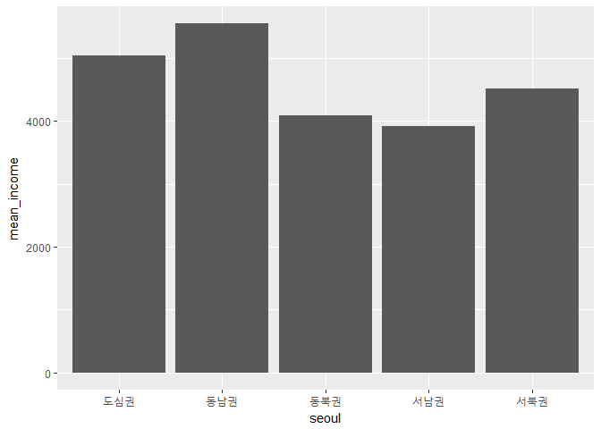
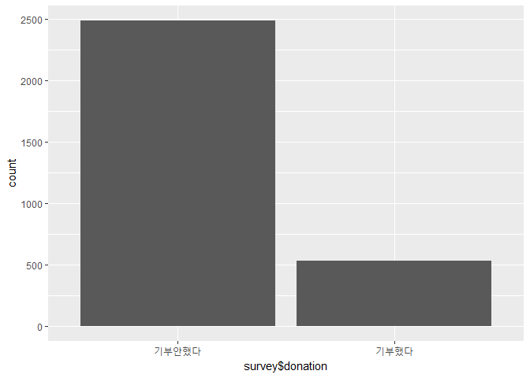
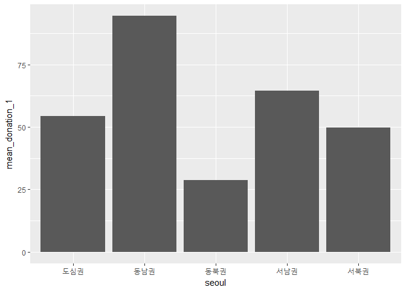
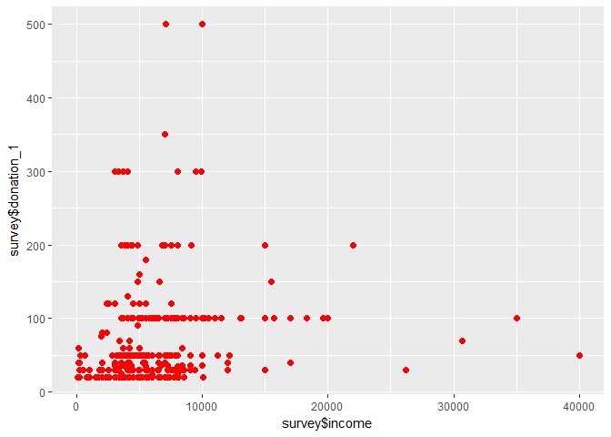
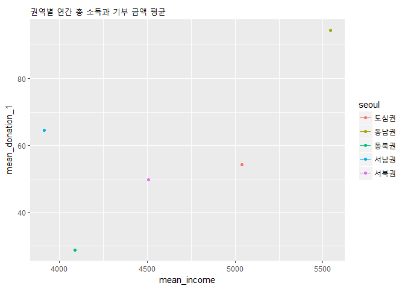

header2 1. 초록
---------------

이 보고서의 목적은 '권역별 총 소득과 기부금액의 상관관계'를 분석하는
것이다. 연구에 사용된 자료는 사회복지실태조사 데이터를 사용했다. 이
데이터를 바탕으로 권역별 총 소득 평균을 내었다. 권역별 기부 금액 평균도
내어 소득 평균이 높게 나타난 지역과 기부 금액 평균이 높게 나온
구(자치구)를 비교해 보았다. 이에 따라 소득과 기부금액의 상관분석을 통해
가설을 검증하였으며 한계점과 비판점을 찾아 볼 것이다.

header2 2. 분석 주제
--------------------

사람이 재정적으로 풍요롭다면, 기부 씀씀이도 커질까? 설문지 문항을 보다가
문득 들은 생각이다. 사람들은 대부분 삶이 어려워서, 경제적으로 여유가
없어서 기부를 안한다고 한다. 그렇다면 소득이 많은 사람들은 기부금액도
커질지 비교해보려고한다.

header2 3. 데이터 분석
----------------------

3-1. 필요한 패키지 불러오기

    library(dplyr)

    ## 
    ## Attaching package: 'dplyr'

    ## The following objects are masked from 'package:stats':
    ## 
    ##     filter, lag

    ## The following objects are masked from 'package:base':
    ## 
    ##     intersect, setdiff, setequal, union

    library(ggplot2)
    library(readxl)

    raw_survey <- read_excel("2015_서울복지실태조사_데이터.xlsx")

    ## Warning in read_fun(path = path, sheet_i = sheet, limits = limits, shim =
    ## shim, : Expecting logical in UM1007 / R1007C559: got '媛쒖씤援먯궗'

    ## Warning in read_fun(path = path, sheet_i = sheet, limits = limits, shim =
    ## shim, : Expecting logical in AES2190 / R2190C825: got '�쒓낏�꾩썝�앺솢'

    ## Warning in read_fun(path = path, sheet_i = sheet, limits = limits, shim =
    ## shim, : Expecting logical in PG2194 / R2194C423: got '1�멸�援�'

    ## Warning in read_fun(path = path, sheet_i = sheet, limits = limits, shim =
    ## shim, : Expecting logical in AES2247 / R2247C825: got '�쒓낏�꾩썝�앺솢'

    ## Warning in read_fun(path = path, sheet_i = sheet, limits = limits, shim =
    ## shim, : Expecting logical in AES2257 / R2257C825: got '�쒓낏�꾩썝�앺솢'

3-2. 데이터 전처리하기

    survey <- raw_survey

    str(survey)

    ## Classes 'tbl_df', 'tbl' and 'data.frame':    3019 obs. of  828 variables:
    ##  $ ID          : num  2 3 4 5 6 7 8 9 10 11 ...
    ##  $ fff_wgt     : num  1473 1460 322 655 588 ...
    ##  $ s_wgt       : num  1.269 1.258 0.277 0.564 0.506 ...
    ##  $ area        : num  3 5 3 3 3 3 3 3 3 3 ...
    ##  $ respondent  : num  1 2 2 1 1 2 1 1 1 1 ...
    ##  $ A1_2_1      : num  1 1 1 1 1 1 1 1 1 1 ...
    ##  $ A1_2_2      : num  2 2 2 2 3 2 3 3 2 2 ...
    ##  $ A1_2_3      : num  3 3 3 3 NA NA 3 NA 3 3 ...
    ##  $ A1_2_4      : num  3 NA NA 3 NA NA NA NA 3 3 ...
    ##  $ A1_2_5      : num  NA NA NA NA NA NA NA NA NA NA ...
    ##  $ A1_2_6      : num  NA NA NA NA NA NA NA NA NA NA ...
    ##  $ A1_2_7      : num  NA NA NA NA NA NA NA NA NA NA ...
    ##  $ A1_2_8      : logi  NA NA NA NA NA NA ...
    ##  $ A1_2_9      : logi  NA NA NA NA NA NA ...
    ##  $ A1_2_10     : logi  NA NA NA NA NA NA ...
    ##  $ A1_3_1      : num  1 1 1 1 2 1 2 2 1 1 ...
    ##  $ A1_3_2      : num  2 2 2 2 2 2 1 1 2 2 ...
    ##  $ A1_3_3      : num  1 1 1 2 NA NA 2 NA 1 1 ...
    ##  $ A1_3_4      : num  2 NA NA 2 NA NA NA NA 2 2 ...
    ##  $ A1_3_5      : num  NA NA NA NA NA NA NA NA NA NA ...
    ##  $ A1_3_6      : num  NA NA NA NA NA NA NA NA NA NA ...
    ##  $ A1_3_7      : num  NA NA NA NA NA NA NA NA NA NA ...
    ##  $ A1_3_8      : logi  NA NA NA NA NA NA ...
    ##  $ A1_3_9      : logi  NA NA NA NA NA NA ...
    ##  $ A1_3_10     : logi  NA NA NA NA NA NA ...
    ##  $ A1_4_1_1    : num  1954 1950 1964 1962 1966 ...
    ##  $ A1_4_1_2    : num  1958 1955 1996 1962 1995 ...
    ##  $ A1_4_1_3    : num  1984 1989 1992 1985 NA ...
    ##  $ A1_4_1_4    : num  1986 NA NA 1988 NA ...
    ##  $ A1_4_1_5    : num  NA NA NA NA NA NA NA NA NA NA ...
    ##  $ A1_4_1_6    : num  NA NA NA NA NA NA NA NA NA NA ...
    ##  $ A1_4_1_7    : num  NA NA NA NA NA NA NA NA NA NA ...
    ##  $ A1_4_1_8    : logi  NA NA NA NA NA NA ...
    ##  $ A1_4_1_9    : logi  NA NA NA NA NA NA ...
    ##  $ A1_4_1_10   : logi  NA NA NA NA NA NA ...
    ##  $ A1_4_2_1    : num  7 1 7 2 4 8 8 6 12 11 ...
    ##  $ A1_4_2_2    : num  6 9 5 3 8 11 9 3 1 3 ...
    ##  $ A1_4_2_3    : num  9 2 10 7 NA NA 2 NA 5 5 ...
    ##  $ A1_4_2_4    : num  8 NA NA 5 NA NA NA NA 8 2 ...
    ##  $ A1_4_2_5    : num  NA NA NA NA NA NA NA NA NA NA ...
    ##  $ A1_4_2_6    : num  NA NA NA NA NA NA NA NA NA NA ...
    ##  $ A1_4_2_7    : num  NA NA NA NA NA NA NA NA NA NA ...
    ##  $ A1_4_2_8    : logi  NA NA NA NA NA NA ...
    ##  $ A1_4_2_9    : logi  NA NA NA NA NA NA ...
    ##  $ A1_4_2_10   : logi  NA NA NA NA NA NA ...
    ##  $ age_1       : num  61 65 51 53 49 77 58 49 50 50 ...
    ##  $ age_2       : num  57 60 19 53 20 71 28 19 49 48 ...
    ##  $ age_3       : num  31 26 23 30 NA NA 25 NA 22 21 ...
    ##  $ age_4       : num  29 NA NA 27 NA NA NA NA 20 22 ...
    ##  $ age_5       : num  NA NA NA NA NA NA NA NA NA NA ...
    ##  $ age_6       : num  NA NA NA NA NA NA NA NA NA NA ...
    ##  $ age_7       : num  NA NA NA NA NA NA NA NA NA NA ...
    ##  $ age_8       : logi  NA NA NA NA NA NA ...
    ##  $ age_9       : logi  NA NA NA NA NA NA ...
    ##  $ age_10      : logi  NA NA NA NA NA NA ...
    ##  $ A1_5_1      : num  1 1 1 1 1 1 1 1 1 1 ...
    ##  $ A1_5_2      : num  1 1 1 1 1 1 1 1 1 1 ...
    ##  $ A1_5_3      : num  1 1 1 1 NA NA 1 NA 1 1 ...
    ##  $ A1_5_4      : num  1 NA NA 1 NA NA NA NA 1 1 ...
    ##  $ A1_5_5      : num  NA NA NA NA NA NA NA NA NA NA ...
    ##  $ A1_5_6      : num  NA NA NA NA NA NA NA NA NA NA ...
    ##  $ A1_5_7      : num  NA NA NA NA NA NA NA NA NA NA ...
    ##  $ A1_5_8      : logi  NA NA NA NA NA NA ...
    ##  $ A1_5_9      : logi  NA NA NA NA NA NA ...
    ##  $ A1_5_10     : logi  NA NA NA NA NA NA ...
    ##  $ A1_6_1      : num  5 5 6 5 5 3 5 5 5 5 ...
    ##  $ A1_7_1      : num  5 5 5 5 5 5 5 5 5 5 ...
    ##  $ A1_8_1      : num  1 1 1 1 3 1 2 3 1 1 ...
    ##  $ A1_9_1      : num  1 1 1 1 1 1 1 1 1 1 ...
    ##  $ A1_6_2      : num  5 5 7 5 5 3 7 5 5 5 ...
    ##  $ A1_7_2      : num  5 5 5 5 5 5 5 5 5 5 ...
    ##  $ A1_8_2      : num  1 1 1 1 5 1 5 5 1 1 ...
    ##  $ A1_9_2      : num  1 1 1 1 1 1 1 1 1 1 ...
    ##  $ A1_6_3      : num  5 5 7 6 NA NA 7 NA 7 5 ...
    ##  $ A1_7_3      : num  5 5 1 5 NA NA 5 NA 1 5 ...
    ##  $ A1_8_3      : num  5 5 5 5 NA NA 5 NA 5 5 ...
    ##  $ A1_9_3      : num  1 1 1 1 NA NA 1 NA 1 1 ...
    ##  $ A1_6_4      : num  6 NA NA 6 NA NA NA NA 7 7 ...
    ##  $ A1_7_4      : num  5 NA NA 5 NA NA NA NA 1 1 ...
    ##  $ A1_8_4      : num  5 NA NA 5 NA NA NA NA 5 5 ...
    ##  $ A1_9_4      : num  1 NA NA 1 NA NA NA NA 1 1 ...
    ##  $ A1_6_5      : num  NA NA NA NA NA NA NA NA NA NA ...
    ##  $ A1_7_5      : num  NA NA NA NA NA NA NA NA NA NA ...
    ##  $ A1_8_5      : num  NA NA NA NA NA NA NA NA NA NA ...
    ##  $ A1_9_5      : num  NA NA NA NA NA NA NA NA NA NA ...
    ##  $ A1_6_6      : num  NA NA NA NA NA NA NA NA NA NA ...
    ##  $ A1_7_6      : num  NA NA NA NA NA NA NA NA NA NA ...
    ##  $ A1_8_6      : num  NA NA NA NA NA NA NA NA NA NA ...
    ##  $ A1_9_6      : num  NA NA NA NA NA NA NA NA NA NA ...
    ##  $ A1_6_7      : num  NA NA NA NA NA NA NA NA NA NA ...
    ##  $ A1_7_7      : num  NA NA NA NA NA NA NA NA NA NA ...
    ##  $ A1_8_7      : num  NA NA NA NA NA NA NA NA NA NA ...
    ##  $ A1_9_7      : num  NA NA NA NA NA NA NA NA NA NA ...
    ##  $ A1_6_8      : logi  NA NA NA NA NA NA ...
    ##  $ A1_7_8      : logi  NA NA NA NA NA NA ...
    ##  $ A1_8_8      : logi  NA NA NA NA NA NA ...
    ##  $ A1_9_8      : logi  NA NA NA NA NA NA ...
    ##  $ A1_6_9      : logi  NA NA NA NA NA NA ...
    ##  $ A1_7_9      : logi  NA NA NA NA NA NA ...
    ##   [list output truncated]

    class(survey$area)

    ## [1] "numeric"

    table(survey$area)

    ## 
    ##   1   2   3   4   5 
    ## 380 770 482 762 625

    list_area <- data.frame(area = c(1:5),
                            seoul = c("도심권",
                                      "동북권",
                                      "서북권",
                                      "서남권",
                                      "동남권"))
    survey <- left_join(survey,list_area,id="area")

    ## Joining, by = "area"

    #Joining, by = "area"

권역별 이름으로 변수명을 바꿔주었다.

3-3. 데이터 사용하기

    ## 연간 총 소득 (권역별로) ##
    survey<- rename(survey,
                    income = B10_Total)
    summary(survey$income)

    ##    Min. 1st Qu.  Median    Mean 3rd Qu.    Max. 
    ##       0    2400    4000   31898    6000  999999

    survey$income <- ifelse(survey$income %in% c(0,999999),NA,survey$income)
    table(is.na(survey$income))

    ## 
    ## FALSE  TRUE 
    ##  2935    84

    summary(survey$income)

    ##    Min. 1st Qu.  Median    Mean 3rd Qu.    Max.    NA's 
    ##      20    2400    4000    4532    5700  108000      84

    area_income <- survey %>% 
      filter(!is.na(income)) %>% 
      group_by(seoul) %>% 
      summarise(mean_income=mean(income))
    area_income

    ## # A tibble: 5 x 2
    ##   seoul  mean_income
    ##   <fct>        <dbl>
    ## 1 도심권       5039.
    ## 2 동남권       5544.
    ## 3 동북권       4089.
    ## 4 서남권       3914.
    ## 5 서북권       4506.

    ggplot(data = area_income,aes(x=seoul,y=mean_income)) + geom_col()

이상치를 결측 처리 한 후 권역별 연간 총소득 평균을 내었다.엉 도심권이
가장 높을 줄 알았지만 동남권이 가장 높고, 그 다음으로 도심권 그리고
서북권이 높게 나타났다.

    ## 기부 의식 ##

    table(survey$D15)

    ## 
    ##    1    2    3 
    ##  158  373 2488

    survey<-rename(survey,
                   donation = D15)
    survey$donation <- ifelse(survey$donation %in% c(1,2),"기부했다","기부안했다")
    table(survey$donation)

    ## 
    ## 기부안했다   기부했다 
    ##       2488        531

    qplot(survey$donation)

    survey$D16 <-ifelse(survey$D16 == 1, "기부한다","기부안한다")
    table(survey$D16)

    ## 
    ## 기부안한다   기부한다 
    ##       2076        943

최근 1년간 기부 경험이 있냐는 질문의 D15와 기부를 할 마음이 있냐는
질문의 D16을 골라 기부의식을 보았다. 1,2로 되어있는 답변 명을 바꿨다.
대부분이 기부 경험이 없으며, 기부할 마음이 없다고 한다. 기부에 대한
생각이 매우 낮은 것을 볼 수 있었다.

    ##기부한 사람들 중 기부 금액
    summary(survey$D15_1)

    ##    Min. 1st Qu.  Median    Mean 3rd Qu.    Max.    NA's 
    ##     1.0    10.0    30.0    55.4    50.0  3000.0    2488

    table(survey$D15_1)

    ## 
    ##    1    2    3    4    5    6    7   10   12   15   20   24   25   30   35 
    ##   20   14    8    3   34    3    2   82   12   18   59    1    2   55    7 
    ##   36   40   50   60   70   75   80   90  100  120  130  150  160  180  200 
    ##   11   16   60    6    3    1    3    3   56   10    2    3    2    1   20 
    ##  300  350  400  500 3000 
    ##    7    3    1    2    1

    survey<- rename(survey,
                    donation_1 = D15_1)
    survey$donation_1 <- ifelse(survey$donation_1 == 9999999,NA,survey$donation_1)
    table(is.na(survey$donation_1))

    ## 
    ## FALSE  TRUE 
    ##   531  2488

    area_donation_1 <- survey %>% 
      filter(!is.na(donation_1)) %>% 
      group_by(seoul) %>% 
      summarise(mean_donation_1 = mean(donation_1))
    area_donation_1  ##권역별 기부금 평균

    ## # A tibble: 5 x 2
    ##   seoul  mean_donation_1
    ##   <fct>            <dbl>
    ## 1 도심권            54.2
    ## 2 동남권            94.4
    ## 3 동북권            28.8
    ## 4 서남권            64.5
    ## 5 서북권            49.7

    ggplot(data = area_donation_1,aes(x=seoul,y=mean_donation_1)) + geom_col()

 D15-1
문항에서 기부한 사람들 중 기부금액을 묻는 질문으로 기부 금액 평균을
내보고, 권역별로 평균을 내었다. 기부금액 역시 소득이 가장 높았던
동남권이 가장 높았고 그 다음으로 서남권, 도심권이 따라왔다.

    cor.test(survey$income, survey$donation_1)

    ## 
    ##  Pearson's product-moment correlation
    ## 
    ## data:  survey$income and survey$donation_1
    ## t = 3.2527, df = 514, p-value = 0.001218
    ## alternative hypothesis: true correlation is not equal to 0
    ## 95 percent confidence interval:
    ##  0.05638707 0.22556902
    ## sample estimates:
    ##      cor 
    ## 0.142015

    ggplot(data = survey, aes(x = survey$income,y=survey$donation_1))+
      geom_point(size = 2, colour = "red") +
      xlim(0,40000) +
      ylim(20,500)

    ## Warning: Removed 2695 rows containing missing values (geom_point).

    A <- area_income
    B <- area_donation_1
    A <- left_join(A, B , id = "seoul")

    ## Joining, by = "seoul"

    ##Joining, by - c("seoul",mean_donation_1")

    A %>% arrange(desc(mean_donation_1))

    ## # A tibble: 5 x 3
    ##   seoul  mean_income mean_donation_1
    ##   <fct>        <dbl>           <dbl>
    ## 1 동남권       5544.            94.4
    ## 2 서남권       3914.            64.5
    ## 3 도심권       5039.            54.2
    ## 4 서북권       4506.            49.7
    ## 5 동북권       4089.            28.8

    ggplot(A, aes(mean_income, mean_donation_1, colour=seoul,group = seoul)) +
      geom_line() +
      geom_point() +
      labs(x = "mean_income", y = "mean_donation_1", 
           title = "권역별 연간 총 소득과 기부 금액 평균")

    ## geom_path: Each group consists of only one observation. Do you need to
    ## adjust the group aesthetic?

 소득이
가장 높은 동남권이 기부금액도 가장 높게 나타나 소득과 기부금액의
상관관계를 알아보았다. p-value 는 0.05보다 작은 0.001218이 나와 유의한
결과임을 알 수 있었지만 상관계수가 0.142015로 두 변수는 아주 약한
상관관계를 가지고 있다고 볼 수 있다. 권역별 소득과 권역별 기부금액
그래프를 비교하고 내림차순으로 표를 만들었다. 서남권은 소득 평균은
낮지만, 기부 금액 평균은 2위로 높게 나타난 것을 보아 소득과 기부금액이
비례하지 않았다.

header2 4. 논의
---------------

### header3 한계점

눈으로 보기에는 권역별 소득과 기부금액 평균이 비슷한 순서로 나타났지만
상관계수를 볼 때 아주 약간의 상관관계를 보여줬다.이 결과를 한번에 나타낼
수 있는 시각자료를 사용하면 좋았을텐데, 아무리 찾아봐도 그래프가
만들어지지않았다. 그리고 3019명의 응답자 중 기부를 한 사람이 509명
뿐이라서 이들이 기부 금액을 대표하기엔 부족했다.

### header3 추후 분석 방향

위 한계점을 보완하기 위해 기부 참여자가 많은 설문지를 이용하면 좋을 것
이다.
